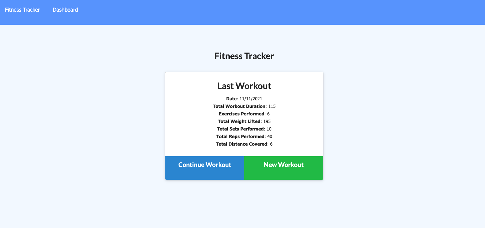
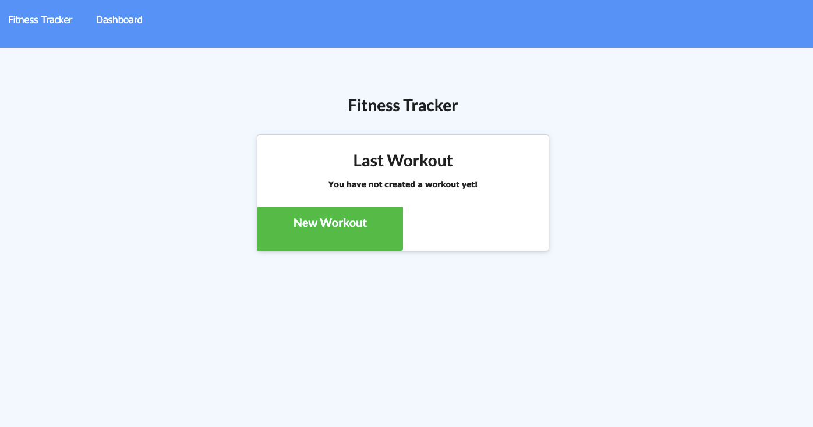

# Workout Tracker

## Description

For week 18 of the UW Coding Bootcamp my homework invited me to create a workout tracker. I was provided with the front end code and was required to create a Mongo database with a Mongoose schema and handle routes with Express.

This application is a fitness tracker that allows a user to create and track daily workouts. A user can log multiple exercises in a workout on a given day. The app has the ability to track the name, type, weight, sets, reps, and duration of an exercise, and there is an option for distance traveled should the exercise be cardio.

## Built With


## Link to Site GitHub Repo

* [Deployed Site via Netlify](https://hw11-notetaker-uwbootcamp.herokuapp.com/notes)
* [Github Repo](https://github.com/spencee1315/Fitness_Tracker)

* Demo of working app via [Screencastify](https://drive.google.com/file/d/1SuZq8IdDh4pGXpdh-bFVJFXnBJ5ThmJu/view)


## Installation 

1. Clone or download repo via Github
2. Run npm install
3. Enter node server.js

## Usage 
### Screenshots

* Homepage - displays last workout


The homepage of the application will display the details of the last workout to the user. From the homepage it will allow the user to choose either to continue the workout or start a new workout. In either case the user is given the option to select either a cardio or lifting exercise to add the their workout. Once chosen the user will input a number details about their exercise chosen which once completed will add that exercise to the current workout. Using the dashboard link at the top of the page a user may view charts of their workouts providing summaries of their 7 most recent workouts.

## Tests

Not applicable.

## Snippet
Route for finding all workouts

```
// GET - all workouts from db
// route /api/workouts
router.get("/api/workouts", (req, res) => {
   
    db.Workout.find({}).then(dbWorkout => {
        dbWorkout.forEach(workout => {
            var total = 0;
            workout.exercises.forEach(e => {
                total += e.workoutTime;
            });
            workout.totalWorkoutTime = total;
        });

        res.json(dbWorkout);
    }) .catch(err => {
        console.error(err.message);
        res.status(500).send('Server Error');
    });
});
```

## License 


## Contributing 
Contributors should read the installation section. 

### Authors
* **Elliott Spencer**

### Contact Information
* [Portfolio Site](https://spencee1315.github.io/hw_wk2/)

* [Github](https://github.com/spencee1315)

* [LinkedIn](https://www.linkedin.com/in/elliott-spencer-886a9818/)